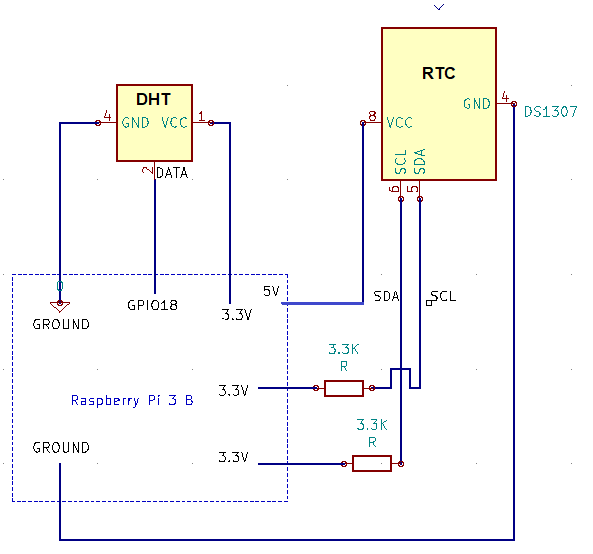

# Weather Station Project

This is a weather station that uses [Secure Scuttlebutt](https://ssbc.github.io/scuttlebutt-protocol-guide/) to store sensor readings. Sensor readings are propogated via [data mule](https://en.wikipedia.org/wiki/Data_mule) rather than by a data link.

This project shows how SSB when applied to IoT can make for a realiable and convenient way to transport data securely when traditional networking infrastructure is scarce.


## Hardware Used

 * Raspberry Pi 3 B
 * Tiny RTC DS1307
 * DHT22 Humidity and Temperature Sensor
 ### Wiring Diagram
  

## Project TODOs

 - [X] Install latest Raspian
 - [X] Setup an Open WiFi AP. [Maybe just use this one](https://github.com/billz/raspap-webgui).
 - [ ] Install latest node version
 - [ ] Install latest `ssb-server` and setup systemd stuff for said `ssb-server`.
 - [ ] Setup systemd stuff for custom weather station code.
 - [ ] Re-write everything in `src/` to use `ssb-client` and the latest (promise-based) `node-dht-sensor`.

## Setup
 ### Clone Repo Somewhere on Pi
  ```
  git clone https://github.com/FoxDotBuild/WeatherStation.git
  ```
 ### [Install NodeJS](https://www.instructables.com/id/Install-Nodejs-and-Npm-on-Raspberry-Pi/)
  ```
  # Download [ver 10.15.3 armV6](https://nodejs.org/en/download/releases)
  # Extract the archive
  sudo tar -C /opt -Jxf node-v10.15.3-linux-arm6l.tar.xz
  
  # Change directory to /opt/
  cd /opt/
  
  # Symbolically link node
  sudo ln -s node-v10.15.3.linux-armv6l node
  
  # Setup path to node
  export PATH="$PATH:/opt/node-v10.15.3-linux-arm6l/bin"
  # Test path
  which node
  ```
 ### Install [ssb-server](https://github.com/ssbc/ssb-server)_
  ```
  # install ssb-server
  sudo /opt/node-v10.15.3-linux-armv6l/bin/npm install -g ssb-server
  
  # Also consider installing by
  sudo -i
  npm install -g ssb-server
  ```
 ### Setup Realtime clock
  ```
  # Load RTC Module
  sudo modprobe rtc-ds1307

  # Config i2c bus to use RTC
  echo ds1307 0x68 | sudo tee /sys/class/i2c-adapter/i2c-1/new_device

  # Read the clock
  sudo hwclock -r
  ```
## Starting
 If everything installed correctly then just run
 ```
 ssb-server start
 ```
 and keep it open.
 
 In a different terminal:
 ```
 # Run index.js in /mini/
 node index.js
 
 # alternate way
 sudo /opt/node-v10.15.3-linux-armv61/bin/node index.js
 ```
## Syncing Data

 * Venture off into the woods, find the weather station.
 * Connect to the device's exposed WiFi network using a smart phone.
 * Open [Manyverse](https://play.google.com/store/apps/details?id=se.manyver) up on your phone.
 * Once Manyverse syncs with the weather station, go home.
 * Open Manyverse on your home WiFi, syncing with other peers.
 * Done! The weather report has now been "gossiped" to other peers on the network.

---
## See Also

 * [SBOT API Docs](https://scuttlebot.io/) - Provides a Javascript API to SSB.
 * [Patchwork](https://github.com/ssbc/patchwork) - A non-trivial SSB app.
 
## Attribution

The code is a heavily gutted version of [easy-ssb-pub](https://github.com/staltz/easy-ssb-pub).
