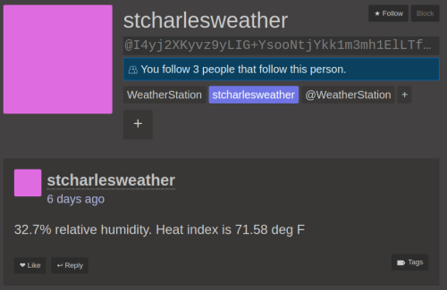
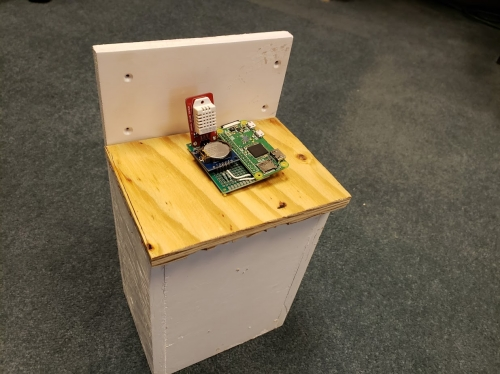

# Weather Station Project

This is a weather station that uses [Secure Scuttlebutt](https://ssbc.github.io/scuttlebutt-protocol-guide/) to store sensor readings. Sensor readings are propogated via [data mule](https://en.wikipedia.org/wiki/Data_mule) rather than by a data link.



## What's Here?
 * `dht2.ino` - Firmware for Arduino (uses DHT22 temp sensor).

## Hardware Used

 * Raspberry Pi Zero W
 * Tiny RTC DS1307
 * DHT22 Humidity and Temperature Sensor

## Hardware Setup

Install Node: TODO
Setup GPIO Library: https://www.techworked.com/install-bcm2835-library-in-raspberry-pi/

Setup realtime clock:

```
# Load RTC Module
sudo modprobe rtc-ds1307

# Config i2c bus to use RTC
echo ds1307 0x68 | sudo tee /sys/class/i2c-adapter/i2c-1/new_device

# Read the clock
sudo hwclock -r

# Install GPIO library

```

Setup WiFi access point: TODO

## See Also

 * [SBOT API Docs](https://scuttlebot.io/) - Provides a Javascript API to SSB.
 * [Patchwork](https://github.com/ssbc/patchwork) - A non-trivial SSB app.

## Setup

 * Build the thing
 * Create an invite code
 * Share invite code with the SSB users intending on collecting sensor data.

## Syncing Data

 * Venture off into the woods, find the weather station.
 * Connect to the device's exposed WiFi network using a smart phone.
 * Open [Manyverse](https://play.google.com/store/apps/details?id=se.manyver) up on your phone.
 * Once Manyverse syncs with the weather station, go home.
 * Open Manyverse on your home WiFi, syncing with other peers.
 * Done! The weather report has now been "gossiped" to other peers on the network.

## Attribution

The code is a heavily gutted version of [easy-ssb-pub](https://github.com/staltz/easy-ssb-pub).
